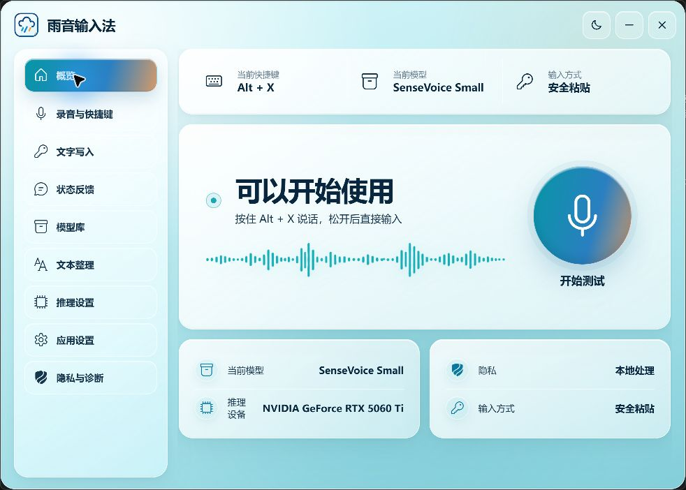
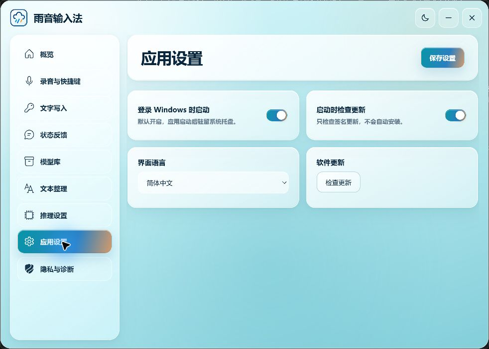

<div align="center">
  
  <h1>雨音输入法 · Rain Vibetype</h1>
  <p><strong>按住快捷键，说完即写入。</strong></p>
  <p>本地优先、保护剪贴板、面向 Windows 11 的开源语音输入工具。</p>

  [](https://github.com/qixiaoyu27/Rain-VibeType/releases/latest)
  [](https://github.com/qixiaoyu27/Rain-VibeType/releases)
  [](#系统要求)
  [](./LICENSE)

  [下载最新版](https://github.com/qixiaoyu27/Rain-VibeType/releases/latest) · [30 秒上手](#30-秒上手) · [使用说明](./docs/使用说明.md) · [隐私边界](#隐私边界) · [参与开发](#参与开发)
</div>

<br />



## 30 秒上手

1. 从 [Releases](https://github.com/qixiaoyu27/Rain-VibeType/releases/latest) 下载 `雨音输入法_*_x64-setup.exe` 并安装。
2. 首次启动点击“下载并自动配置”，Rain 会安装轻量原生推理组件和推荐的 SenseVoice Small 原生模型。
3. 把光标放进任意输入框，按住 `Ctrl + Shift + Space` 说话，松开后文字会自动写入。

> 当前安装包尚未使用商业代码签名证书。Windows SmartScreen 若提示“已保护你的电脑”，请先确认发布者和下载来源，再选择“更多信息” → “仍要运行”。

完整的安装、托盘和故障排查步骤见 [朋友体验使用说明](./docs/使用说明.md)。

## 为什么是 Rain

| 能力 | Rain 的处理方式 |
| --- | --- |
| 本地识别 | 录音和识别均在本机完成，不上传语音 |
| 实时预览 | 可选流式小模型在浮条显示当前听到的文字，最终输入仍由 SenseVoice 独立完成 |
| 安全写回 | 录音开始时记录目标应用，识别完成后再次校验 |
| 剪贴板保护 | 粘贴前完整快照；用户期间复制了新内容时不覆盖 |
| 按需运行 | 默认使用原生 SenseVoice；其他模型按需使用 CPU / NVIDIA 组件 |
| 无历史记录 | 不保存录音，也不建立识别文字历史 |
| 可取消 | 录音、等待模型和识别阶段均可按 `Esc` 取消 |

```text
快捷键 → 内存录音 → 本地模型识别 → 可选本地文本整理 → 校验目标 → 安全写入
```

## 体验亮点

- 默认“按住说话，松开识别”，也支持按一次开始、再按一次结束。
- SenseVoice Small 默认使用 Rust / sherpa-onnx 原生 Worker；Fun-ASR Nano 和 Paraformer-zh 保留 Python / FunASR 组件。
- 可选中英文流式 Zipformer 仅用于录音浮条的实时文字预览；它的结果不会替换 SenseVoice 最终转录。
- 默认使用安全粘贴，也可切换为 Unicode 模拟逐字输入。
- 自动检测 NVIDIA 显卡；GPU 加载失败时可确认回退到 CPU。
- 可选 Qwen3 0.6B + llama.cpp 本地文本整理，用于标点和分段；失败时保留原始识别文字。
- 简体中文默认界面，支持跟随系统和 English。
- 常驻系统托盘，可配置开机启动、提示音、浮条和模型卸载策略。

<details>
<summary><strong>查看设置界面</strong></summary>

<br />



</details>

## 系统要求

- Windows 11 x64
- Intel / AMD 处理器；NVIDIA 显卡可选，用于 CUDA 加速
- 可用麦克风、WebView2 和联网下载模型的能力
- 建议预留至少 10 GB 磁盘空间；实际占用取决于所选推理组件和模型

基础安装包不包含 PyTorch、CUDA、llama.cpp 或模型权重。首次配置只会在用户明确点击后下载所需组件，支持断点续传、SHA-256 校验和原子安装。

## 隐私边界

- 音频仅在内存中处理，不保存录音。
- 识别文本、剪贴板内容和窗口标题不写入日志或诊断包。
- 默认无遥测；匿名崩溃报告默认关闭并在提交前确认。
- 更新检查与模型下载相互独立；推理框架是模型的自动依赖，只在用户明确点击模型下载或修复后传输。
- 有已安装模型引用时不会卸载对应推理框架；删除最后一个引用模型时自动清理。
- 模型删除只允许作用于 Rain 管理的模型目录。

## 参与开发

技术栈：Tauri 2、Rust、原生静态前端、sherpa-onnx Worker，以及供其他模型使用的 Python / FunASR Worker。要求 Windows 11 x64、Rust MSVC、Node.js、Python 和 WebView2。

```powershell
.\scripts\setup-worker.ps1
npm install
npm run dev
```

常用检查：

```powershell
cargo test --all-targets --manifest-path .\src-tauri\Cargo.toml
python -m unittest worker.test_worker -v
node --check .\src\main.js
node --check .\src\overlay.js
node --check .\src\cancel.js
```

真实模型、应用兼容性和剪贴板格式验证以 [Windows 验收清单](./docs/WINDOWS_ACCEPTANCE.md) 为准。

<details>
<summary><strong>发布者说明</strong></summary>

<br />

`scripts/build-runtimes.ps1` 生成同时支持 SenseVoice 和流式预览的原生 Worker、Python CPU / NVIDIA Worker ZIP 以及 `runtime-manifest.json`；`scripts/release.ps1` 校验最终转录与预览模型资产，并生成轻量 NSIS 安装包及签名更新产物。正式自动更新需要配置 Tauri 更新公钥和私钥。

模型清单位于 `src-tauri/resources/models.json`，文本运行时清单位于 `src-tauri/resources/text-runtime-manifest.json`。发布前必须重新核对来源、大小和 SHA-256。

</details>

## 许可证

本项目采用 [GNU Affero General Public License v3.0](./LICENSE)（`AGPL-3.0-only`）。
